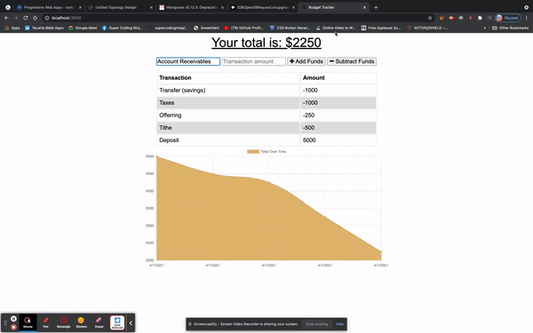

<h1 align="center">Progressive Budget Tracker</h1>

<figcaption align="center">👇🏿Click the .gif, below👇🏿 to view a video demonstation.
</img>
<figcaption align="center">Click 👉🏿<a href="https://uwprogressivebudget.herokuapp.com/">here</a>👈🏿 to experience this application, yourself!</figcaption>

<figcaption align="center">👇Successful👇🏿 build on Heroku.
</img>

## Table of Contents
* [Repository Description](#Repository)
* [User Story](#User)
* [Usage Information](#Usage)
* [Contribution Guidelines](#Contribution)
* [Functionality](#Functionality)
* [Overview](#Overview)
* [References](#Ref)
* [Acknowledgements](#Ack)
* [Repositiory End-Goal Criterea](#Criterea)

## Repository Description

 I built a budgeting application, in order to keep track of my financespersonal finances. I utilized IndexedDB, cache API, and Service Workers, which provided an offline experience for the application.  Yes, the user will be able to work online and update information without missing a beat!  The application automatically saves to your device local storage; and will remain there until you clear out your browser's cache!  I will also use webpack, to minimize CSS an JavaScript, to implement tree-shaking.

## User Story
###### [Back to Table of Contents](#Table-of-Contents)

### As A Client
I want something that will measure and optimize the performance of my web applications. Today many of my users around the world, can access the web from older mobile devices; which means slower connections.  As our web applications continue to grow both, in size and complexity, so does my customers load times on their; which means that I can potentially lose them to competitors, if I do not address this, quickly.  I want to ensure that all of users have a good experience, optimizing performance is also an important consideration.

### As A Developer
    1.  I want to use tools such as Chrome Devtools, and Google Lighthouse; which are my primary tools for measuring web application performance.  Devtools allows me to monitor network traffic ,and inspect the size of resources downloaded to the browser; such as HTML, CSS, JavaScript and images.  Lighthouse provides a performance scoring system, based on metrics; such as application bundle size, time to interaction, time to first meaningful paint, and more!

    2.  In order to deliver smaller application bundle sizes to the client, I'll perform several optimizations that involve compressing assets. This includes minifying JavaScript and CSS files, as well as compressing images. Another technique utilized to improve initial bundle size, will be lazy loading, where we will defer loading certain assets until they're needed by the application.

## Usage Information
###### [Back to Table of Contents](#Table-of-Contents)

## Contribution Guidelines
###### [Back to Table of Contents](#Table-of-Contents)
We're a lot happier when we share!  Pleasse feel free to contribute to this most meaniful application I have ever done (final requirement for graduation).

### Helpful Starter Links
###### [Back to Table of Contents](#Table-of-Contents)

* [Why Performance Matters](https://developers.google.com/web/fundamentals/performance/why-performance-matters/)

* [Measure Web Performance With The RAIL Model](https://developers.google.com/web/fundamentals/performance/rail)

* [Audit the Performance of Your Web Application](https://developers.google.com/web/fundamentals/performance/audit/)

* [Google Lighthouse](https://developers.google.com/web/tools/lighthouse/)

* [Your First Progressive Web App](https://developers.google.com/web/fundamentals/codelabs/your-first-pwapp/)

### Key Topics
Some key topics that you may want to look into, before you get started are: 
* Lighthouse

* Lazy Loading

* Minification

* Compression

* PWAs

* Service Workers

* Webpack

## Overview: What We Accomplished!
###### [Back to Table of Contents](#Table-of-Contents)

## References
###### [Back to Table of Contents](#Table-of-Contents)
1.  [NPMjs](https://www.npmjs.com/) provides Documentation, Installation, Examples, Methods, Objects, Questions, Answers, Separator, Prompt Types, User Interfaces and Layouts, Reactive Interface, Support, Known issues, News, Contributing, License, and Plugins.

2.  [Shields IO](https://shields.io/) provides documentations on how to add your shield, for creditbility.  Please feel free to view this resource, for your future developments.

3.  **[Eloquent JavaScript](https://eloquentjavascript.net/)**, 3rd edition (2018)
This is a book about JavaScript, programming, and digital wonders. Read it online here; or get your own paperback copy.  Written by Marijn Haverbeke.  Licensed under a Creative Commons attribution-noncommercial license. All code in this book may also be considered licensed under an MIT license.

5.  [Guide to Handlebars: Templating Engine for Node/JavaScript](https://stackabuse.com/guide-to-handlebars-templating-engine-for-node/) explains that express is a routing, and middleware is a web framework; which has minimal functionality of its own (express applications are series of middleware function calls).

6.  [Markdown Syntax](https://www.markdownguide.org/basic-syntax/) provides documentations on how to add your shield, for creditbility.  Please feel free to view this resource, for your future developments.

## Ackowledgements
###### [Back to Table of Contents](#Table-of-Contents)

### Peer Code Review
I would like to thank my class peers, all of the Teacher Assistants, my tutor, my Student Success Manager; and my Instructor.

### CodeBase
Codebase provided by [University of Washington](https://www.pce.uw.edu/), and [Trilogy Education](https://www.trilogyed.com/) (a 2U, Inc. brand),  in coorelation to their Seattle Partnership [UW Coding Bootcamp](https://bootcamp.uw.edu/).

## Repositiory End-Goal Criterea
###### [Back to Table of Contents](#Table-of-Contents)
Make it a point to tackle new code, weekly (at least, periodaclly); and break it down.  Try to understand the concepts, yourself.  This only makes you more credible, and a stonger developer: because you've taken the tim to study!  Remember this also, as a developer, your goal should be designing NEW experiences that makes people's lives simple; because as developers, we solve problems that people didn't even knew they had- even better, in a way that they do not understand: We are the super heroes and heriones of tomorrow; so get coding, and I hope this repository helps you along your development.  Stay on task, Get Ahead, Change The World! - [Frederick Thomas](https://www.linkedin.com/in/discoverfrederickthomas/), Super Coding Ninja™

## License

<i>Progressive Budget</i><b> ©</b>  2021 Frederick Thomas, [Super Coding Ninja™](https://github.com/supercodingninja).

Permission is hereby granted, free of charge, to any person obtaining a copy of this software and associated documentation files (the "Software"), to deal in the Software without restriction, including without limitation the rights to use, copy, modify, merge, publish, distribute, sublicense, and/or sell copies of the Software, and to permit persons to whom the Software is furnished to do so, subject to the following conditions:

The above copyright notice and this permission notice shall be included in all copies or substantial portions of the Software.

THE SOFTWARE IS PROVIDED "AS IS", WITHOUT WARRANTY OF ANY KIND, EXPRESS OR IMPLIED, INCLUDING BUT NOT LIMITED TO THE WARRANTIES OF MERCHANTABILITY, FITNESS FOR A PARTICULAR PURPOSE AND NONINFRINGEMENT. IN NO EVENT SHALL THE AUTHORS OR COPYRIGHT HOLDERS BE LIABLE FOR ANY CLAIM, DAMAGES OR OTHER LIABILITY, WHETHER IN AN ACTION OF CONTRACT, TORT OR OTHERWISE, ARISING FROM, OUT OF OR IN CONNECTION WITH THE SOFTWARE OR THE USE OR OTHER DEALINGS IN THE SOFTWARE.
